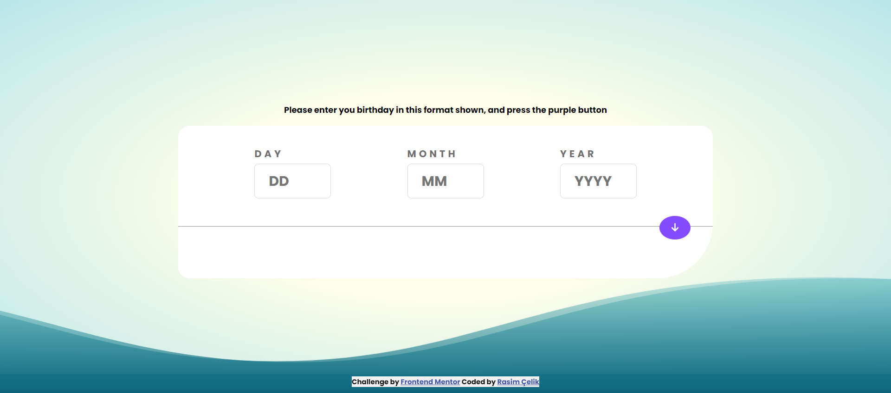
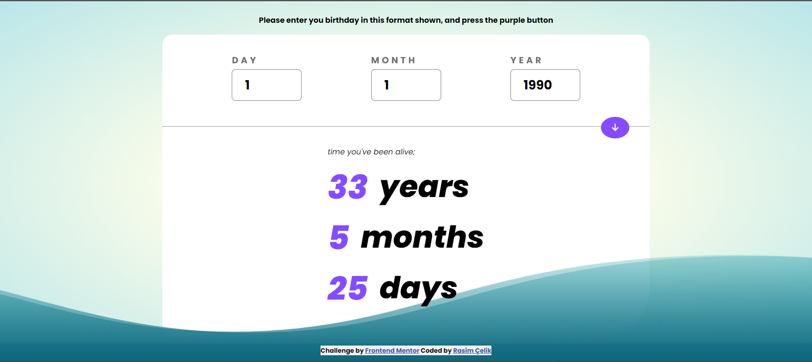

## Welcome! 👋

Thanks for checking out this front-end coding challenge.

[Frontend Mentor](https://www.frontendmentor.io) challenges help you improve your coding skills by building realistic projects.

# Frontend Mentor - Age calculator app solution

This is a solution to the [Age calculator app challenge on Frontend Mentor](https://www.frontendmentor.io/challenges/age-calculator-app-dF9DFFpj-Q). Frontend Mentor challenges help you improve your coding skills by building realistic projects.

## Table of contents

- [Overview](#overview)
  - [The challenge](#the-challenge)
  - [Screenshot](#screenshot)
  - [Links](#links)
- [My process](#my-process)
  - [Built with](#built-with)
  - [What I learned](#what-i-learned)
  - [Continued development](#continued-development)
  - [Useful resources](#useful-resources)
- [Author](#author)
- [Acknowledgments](#acknowledgments)

## Overview

### The challenge

Users should be able to:

✅- View an age in years, months, and days after submitting a valid date through the form

- Receive validation errors if:

  ✅ - Any field is empty when the form is submitted
  ✅ - The day number is not between 1-31
  ✅ - The month number is not between 1-12
  ✅ - The year is in the future
  ✅ - The date is invalid e.g. 31/04/1991 (there are 30 days in April)
  ✅- View the optimal layout for the interface depending on their device's screen size
  ✅- See hover and focus states for all interactive elements on the page
  ✅- **Bonus**: See the age numbers animate to their final number when the form is submitted

### Screenshot





### Links

- Solution URL: [https://alived.netlify.app/]
- Live Site URL: [https://alived.netlify.app/]

## My process

### Built with

- Semantic HTML5 markup
- CSS custom properties
- Flexbox
- CSS Grid
- Mobile-first workflow
- Javascript

### What I learned

Use this section to recap over some of your major learnings while working through this project. Writing these out and providing code samples of areas you want to highlight is a great way to reinforce your own knowledge.

To see how you can add code snippets, see below:

```css
.row-results-layers span {
  opacity: 0; /* Initially set opacity to 0 */
  margin-right: 10px;
  font-size: 34px;
  margin-top: -6px;
  color: var(--purple-color);
  animation: fadeInFromLeft 1.5s forwards; /* Apply the animation */
}

@keyframes fadeInFromLeft {
  from {
    opacity: 0;
    transform: translateX(-100%); /* Start from left */
  }
  to {
    opacity: 1;
    transform: translateX(0%); /* End at original position */
  }
}
```

```js
button.addEventListener("click", () => {
  let ageYear = currentYear - year;
  let ageMonth = currentMonth - month;
  let ageDay = currentDay - day;

  //   case if month difference less then 0
  if (ageMonth < 0 || (ageMonth === 0 && ageDay < 0)) {
    ageYear--;
    ageMonth += 12;
  }

  //   last case if day difference less then 0
  if (ageDay < 0) {
    const daysInPreviousMonth = new Date(year, month - 1, 0).getDate();
    ageMonth--;
    ageDay += daysInPreviousMonth;
  }
});
```

### Useful resources

- [Example resource 1](https://codepen.io/tedmcdo/pen/PqxKXg) - This helped me for creating ocean animation. I really liked this pattern and will use it going forward.

## Author

- Website - [Rasim Çelik](https://alived.netlify.app/)
- Frontend Mentor - [@rasimcelik](https://www.frontendmentor.io/profile/rasimcelik)
- Twitter - [@celikrasimm](https://www.twitter.com/celikrasimm)
